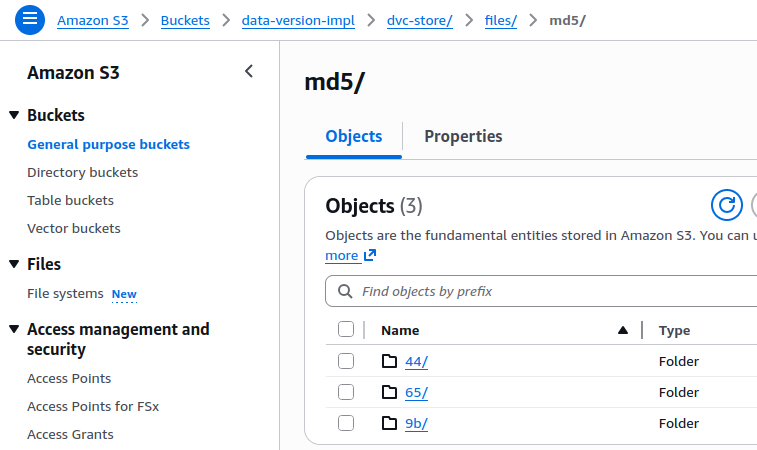

# Data Versioning with DVC

Hands-on implementation of DVC (Data Version Control) using a dummy CSV dataset.
Demonstrates how Git + DVC + S3 work together to version large data files.

---

## Tool comparison — DVC vs Pachyderm vs Delta Lake vs LakeFS

### How each tool versions data

| | DVC | Pachyderm | Delta Lake | LakeFS |
|---|---|---|---|---|
| **Versioning mechanism** | MD5 hash per file, pointer stored in Git | Internal commit graph (own VCS) | Transaction log (`_delta_log/`) appended on every write | Git-like commits on top of object storage |
| **Where versions live** | Git (pointers) + S3/GCS (data) | Pachyderm's own object store | Alongside data files in same S3 path | S3/GCS with a metadata layer on top |
| **Granularity** | File-level | File-level | Row/partition-level (Parquet) | File and directory-level |
| **Time travel** | `git checkout <hash>` + `dvc pull` | `pachctl get file repo@branch` | `SELECT * FROM table VERSION AS OF 3` | `git checkout` style on lakefs branches |

---

### Feature comparison

| Feature | DVC | Pachyderm | Delta Lake | LakeFS |
|---|---|---|---|---|
| **Primary purpose** | Data + ML experiment versioning | Data pipelines + versioning | ACID transactions on data lakes | Git for data lakes |
| **Git integration** | Tight — `.dvc` files live in Git | None — separate system | None | Mimics Git but separate from code Git |
| **Pipeline support** | Basic (`dvc.yaml` stages) | First-class, Kubernetes-native | None (storage layer only) | None (storage layer only) |
| **Storage backend** | S3, GCS, Azure, local, SSH | Built-in (runs on K8s) | S3, ADLS, GCS (Parquet/Delta format) | S3, GCS, Azure |
| **Data format** | Any file (CSV, Parquet, images, models) | Any file | Parquet only | Any file |
| **ACID transactions** | No | No | Yes | No |
| **Branching** | Via Git branches | Native branches | Table clones (shallow) | Full branch/merge/PR |
| **Setup complexity** | Low — `pip install dvc` | High — requires Kubernetes cluster | Medium — needs Spark or Delta engine | Medium — runs as a proxy over S3 |
| **Scale** | Small to medium datasets | Large-scale pipelines | Petabyte-scale tabular data | Large data lakes |
| **ML experiment tracking** | Yes (with DVC Studio) | No | No | No |

---

### How each tool resolves "give me version 2 of this data"

**DVC**
```
git checkout <commit> -- data/customers.csv.dvc
         ↓
reads md5 hash from .dvc file
         ↓
dvc pull → downloads s3://bucket/dvc-store/files/md5/<hash>
         ↓
data/customers.csv = exact file from that commit
```

**Pachyderm**
```
pachctl get file customers@v2:/customers.csv
         ↓
Pachyderm's internal commit graph resolves v2
         ↓
streams file from its internal object store
```

**Delta Lake**
```sql
SELECT * FROM customers VERSION AS OF 2
-- or --
SELECT * FROM customers TIMESTAMP AS OF '2024-01-15'
         ↓
reads _delta_log/000002.json → finds which Parquet files were active
         ↓
reads those Parquet files from S3
```

**LakeFS**
```bash
aws s3 cp s3://lakefs-repo/v2-branch/customers.csv .
         ↓
LakeFS intercepts the S3 call
         ↓
resolves v2-branch → commit → actual object in underlying S3
```

---

### When to pick which tool

| Situation | Best choice |
|-----------|-------------|
| ML project, need code + data versioned together | **DVC** |
| Need data pipelines that auto-trigger on data changes | **Pachyderm** |
| Big data / Spark, need ACID + row-level time travel | **Delta Lake** |
| Large data lake, want Git branching for data (A/B, staging) | **LakeFS** |
| Simple setup, small team, CSV / model files | **DVC** |
| Already on Kubernetes, heavy pipeline orchestration | **Pachyderm** |

---

### Key difference in one line each

- **DVC** — Git is the version index; S3 is a dumb file store addressed by hash.
- **Pachyderm** — Kubernetes-native pipelines where data commits trigger pipeline runs automatically.
- **Delta Lake** — Adds a transaction log to S3 so Parquet tables get ACID guarantees and SQL time travel.
- **LakeFS** — Puts a Git-like branch/commit/merge interface in front of your entire S3 bucket.

---

## Mental model

```
Git     →  which version to use  (stores .dvc pointer files)
DVC     →  how to fetch it       (resolves hash → remote)
S3      →  where the data lives  (stores actual files by hash)
```

S3 has no concept of versions or commits — that lives entirely in Git.

---

## Project structure

```
.
├── data/
│   ├── customers.csv          # active dataset (tracked by DVC, not Git)
│   ├── customers.csv.dvc      # pointer file committed to Git
│   ├── customers_v1.csv       # reference: 5 customers
│   ├── customers_v2.csv       # reference: 7 customers
│   └── customers_v3.csv       # reference: 10 customers
├── .dvc/
│   └── config                 # remote storage config (committed to Git)
├── pyproject.toml             # Python dependencies
├── .gitignore
├── .dvcignore
├── setup.txt                  # environment setup instructions
└── plan.md                    # step-by-step implementation plan
```

---

## Prerequisites

- Python 3.8+
- Git
- uv (Python package manager)

```bash
git --version     # git version 2.x.x
python3 --version # Python 3.8+
uv --version      # uv 0.x.x
```

---

## Setup

### 1. Install dependencies

```bash
uv sync
```

Installs `dvc>=3.0.0` and `dvc-s3>=3.0.0` into `.venv/`.

```bash
dvc --version
# Expected: dvc 3.x.x
```

### 2. Configure Git identity

```bash
git config --global user.name "Your Name"
git config --global user.email "your@email.com"
```

### 3. Initialize DVC

```bash
dvc init
git add .dvc .dvcignore
git commit -m "init: dvc setup"
```

### 4. Configure AWS CLI (for S3 remote)

```bash
uv tool install awscli
echo 'export PATH="$HOME/.local/bin:$PATH"' >> ~/.bashrc
source ~/.bashrc

aws --version
aws configure    # enter Access Key, Secret Key, region
```

**IAM policy required** — attach this inline policy to your IAM user:

```json
{
  "Version": "2012-10-17",
  "Statement": [
    {
      "Effect": "Allow",
      "Action": ["s3:ListBucket"],
      "Resource": "arn:aws:s3:::data-version-impl"
    },
    {
      "Effect": "Allow",
      "Action": ["s3:GetObject", "s3:PutObject", "s3:DeleteObject"],
      "Resource": "arn:aws:s3:::data-version-impl/*"
    }
  ]
}
```

> Note: `ListBucket` targets the bucket ARN; object actions target `ARN/*`. This split is an AWS requirement.

### 5. Add S3 remote

```bash
dvc remote add -d s3remote s3://data-version-impl/dvc-store
git add .dvc/config
git commit -m "config: add S3 DVC remote"
```

Verify:
```bash
aws s3 ls s3://data-version-impl/
# Expected: no error (empty bucket is fine)
```

---

## Creating versioned commits

Each version copies the reference CSV into `data/customers.csv`, tracks it with DVC, and pushes to S3.

**Version 1 — 5 customers**
```bash
cp data/customers_v1.csv data/customers.csv
dvc add data/customers.csv
git add data/customers.csv.dvc data/.gitignore
git commit -m "data: customers v1 - 5 rows"
dvc push
```

**Version 2 — 7 customers, Carol upgraded to Premium**
```bash
cp data/customers_v2.csv data/customers.csv
dvc add data/customers.csv
git add data/customers.csv.dvc
git commit -m "data: customers v2 - 2 new customers, Carol upgraded to Premium"
dvc push
```

**Version 3 — 10 customers, spend refreshed**
```bash
cp data/customers_v3.csv data/customers.csv
dvc add data/customers.csv
git add data/customers.csv.dvc
git commit -m "data: customers v3 - 10 customers, spend refreshed"
dvc push
```

Verify all 3 versions are stored:
```bash
git log --oneline
aws s3 ls s3://data-version-impl/dvc-store/ --recursive
# Expected: 3 objects (one per version hash)
```

---

## Time travel — switching between versions

Use `git checkout` to point to a version's `.dvc` file, then `dvc pull` to fetch that data from S3.

**Go to v1:**
```bash
git checkout 4c407c1 -- data/customers.csv.dvc
dvc pull
cat data/customers.csv
# Expected: 5 rows, Alice spend = 15000
```

**Go to v2:**
```bash
git checkout aba2ce7 -- data/customers.csv.dvc
dvc pull
cat data/customers.csv
# Expected: 7 rows, Carol segment = Premium
```

**Return to v3 (latest):**
```bash
git checkout master -- data/customers.csv.dvc
dvc pull
cat data/customers.csv
# Expected: 10 rows, Alice spend = 21000
```

---

## How DVC fetches a specific data version

This is the core mechanism — understanding this makes everything else obvious.

### Step 1 — `dvc add` computes an MD5 hash

When you run `dvc add data/customers.csv`, DVC computes an MD5 hash of the file contents:

```
MD5(customers.csv contents) → e83c4b9f2a1d...
```

It writes this hash into `data/customers.csv.dvc`:

```yaml
outs:
- md5: e83c4b9f2a1d7c3b9e2f1a4d6c8b0e5f
  size: 312
  path: customers.csv
```

This tiny file is what Git commits. The actual CSV never enters Git.

---

### Step 2 — `dvc push` stores the file by its hash in S3

DVC uploads the file to S3 using the hash as the path.
The full S3 path structure DVC creates is:

```
s3://data-version-impl/dvc-store/files/md5/<first-2-chars>/<rest-of-hash>
```

The first 2 characters of the MD5 hash become a folder, the rest is the filename.
This is content-addressable storage — the path IS the identity of the file.

After pushing all 3 versions, the actual S3 layout looks like this
(confirmed from AWS Console: `data-version-impl > dvc-store > files > md5`):



```
dvc-store/
└── files/
    └── md5/
        ├── 44/   ← first 2 chars of v? hash  (one of the 3 customer versions)
        ├── 65/   ← first 2 chars of v? hash
        └── 9b/   ← first 2 chars of v? hash
```

Each folder contains exactly one file — the full data file stored under its hash.
S3 stores all versions simultaneously. It has no idea which is "latest" — that is Git's job.

---

### Step 3 — Git commits track which hash is active

Each Git commit holds a snapshot of `customers.csv.dvc` with a specific hash:

```
Commit 4c407c1  →  customers.csv.dvc  →  md5: e83c4b9f...  (v1, 5 rows)
Commit aba2ce7  →  customers.csv.dvc  →  md5: a19f2c3d...  (v2, 7 rows)
Commit d9b4d29  →  customers.csv.dvc  →  md5: 7d2e1f3a...  (v3, 10 rows)
```

Git is the version index. S3 is just a content store.

---

### Step 4 — `git checkout` + `dvc pull` resolves the chain

When you run:

```bash
git checkout 4c407c1 -- data/customers.csv.dvc
dvc pull
```

Here is exactly what happens internally:

```
1. git checkout  →  writes e83c4b9f... into customers.csv.dvc on disk
2. dvc pull      →  reads customers.csv.dvc, extracts md5: e83c4b9f...
3. DVC checks local cache (~/.dvc/cache) — is e83c4b9f... already there?
   YES → copies from cache to data/customers.csv  (no network call)
   NO  → downloads s3://data-version-impl/dvc-store/e8/3c4b9f... from S3
         stores it in local cache
         copies to data/customers.csv
4. You now have v1 data locally
```

The local cache (`~/.dvc/cache`) means repeated pulls of the same version cost nothing — DVC never re-downloads a file it already has.

---

### Full picture in one diagram

```
git checkout <commit>
      │
      ▼
customers.csv.dvc  ←── contains md5 hash of that version
      │
      ▼
dvc pull
      │
      ├── check ~/.dvc/cache/<hash>
      │         hit  → copy to data/customers.csv
      │         miss ↓
      └── S3: dvc-store/files/md5/<first-2-chars>/<rest-of-hash>
                  │
                  ▼
            data/customers.csv  ← exact file for that Git commit
```

This is why DVC is called a "control layer" — it doesn't store data itself,
it controls where data lives and which version maps to which Git commit.

---

## What each step proves

| Action | Concept |
|--------|---------|
| `dvc add` | Replaces the data file with a tiny hash pointer in Git |
| `git commit` (`.dvc` file) | Git stores the pointer, never the actual data |
| `dvc push` | Actual data uploaded to S3 under its hash |
| New `dvc add` on changed file | New hash = new version; old version preserved in S3 |
| `git checkout` + `dvc pull` | Full time travel — code and data move together |

---

## Notes

- Never manually edit `.dvc` files — they are managed by DVC.
- Always run `dvc push` after `git commit` to keep code and data in sync.
- `data/customers.csv` is excluded from Git by `data/.gitignore` (auto-generated by DVC). Do not add `/data/` to the root `.gitignore` — that would block the `.dvc` pointer files too.
